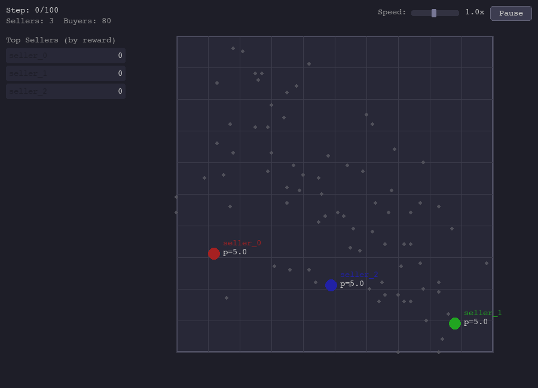

# spatial-competition-jax

JAX-native environment and MAPPO training pipeline for dynamic spatial competition, inspired by Hotelling's model and extended with multiple horizontal dimensions, vertical differentiation, reservation prices, and non-uniform buyer distributions.

<p align="center">
  
</p>

All environment logic is expressed as pure functions over JAX arrays. `jax.jit` and `jax.vmap` work out of the box, enabling GPU-accelerated parallel training across hundreds of environments simultaneously.

## Features

**Environment**

- **Arbitrary dimensions** -- 1D (linear city), 2D (plane), or N-D spatial markets
- **Continuous and discrete action spaces** -- movement + price (+ quality) as continuous vectors or factored categoricals
- **Horizontal and vertical differentiation** -- location-based competition with optional quality dimension
- **Reservation prices** -- buyers with heterogeneous valuations who may choose not to purchase
- **Non-uniform buyer distributions** -- uniform, Gaussian, or Gaussian mixture spatial distributions
- **Softmax buyer choice** -- temperature-controlled probabilistic seller selection with annealing
- **Interactive Pygame renderer** -- real-time 1D/2D visualisation with pause, speed control, and entity inspection

**Training**

- **MAPPO** -- multi-agent PPO with shared or independent parameters
- **Multiple network architectures** -- MLP, Conv1D (1D spatial), Conv2D (2D spatial) with factored discrete or continuous heads
- **Egocentric and global observations** -- per-agent or shared-state observation modes
- **Independent PPO** -- per-agent actor heads with shared backbone for asymmetric strategies
- **PSRO** -- symmetric and asymmetric Policy-Space Response Oracles for Nash equilibrium search
- **TensorBoard logging** -- training metrics, evaluation stats, and exploitability tracking

## Installation

Requires Python >= 3.10, < 3.13.

```bash
# Clone the repository
git clone https://github.com/FedeZara/spatial-competition-jax.git
cd spatial-competition-jax

# Install with Poetry (all dependency groups)
poetry install --with marl,render,dev

# Or install only core + training (no Pygame renderer)
poetry install --with marl
```

JAX is configured for CUDA 12 by default. For CPU-only usage, install JAX separately:

```bash
pip install jax[cpu]
```

## Quick Start

```python
import jax
import jax.numpy as jnp
from spatial_competition_jax import SpatialCompetitionEnv, INFO_COMPLETE

env = SpatialCompetitionEnv(
    num_sellers=2,
    max_buyers=100,
    dimensions=1,
    space_resolution=100,
    max_price=10.0,
    max_step_size=0.05,
    new_buyers_per_step=30,
    max_env_steps=200,
)

# JIT-compile for GPU acceleration
jit_reset = jax.jit(env.reset)
jit_step = jax.jit(env.step)

key = jax.random.PRNGKey(0)
obs, state = jit_reset(key)

# Random actions: movement (S, D) and price (S,)
key, k_act, k_step = jax.random.split(key, 3)
actions = {
    "movement": jax.random.uniform(k_act, (2, 1), minval=-0.05, maxval=0.05),
    "price": jax.random.uniform(k_act, (2,), minval=1.0, maxval=9.0),
}

obs, state, rewards, dones, info = jit_step(k_step, state, actions)
```

## Environment

### Overview

`SpatialCompetitionEnv` models a market where `S` sellers compete for `B` buyers on a discretised `D`-dimensional grid. Each step, sellers choose their location and price (and optionally quality). Buyers select the seller maximising their utility and the seller earns revenue from sales, minus movement and production costs.

All state is stored in a Flax `struct.dataclass` pytree (`EnvState`), making the entire environment compatible with JAX transformations.

### Configuration

| Parameter                  | Type          | Default | Description                                                    |
| -------------------------- | ------------- | ------- | -------------------------------------------------------------- |
| `num_sellers`              | `int`         | `3`     | Number of competing sellers                                    |
| `max_buyers`               | `int`         | `200`   | Maximum concurrent buyers (fixed array size)                   |
| `dimensions`               | `int`         | `2`     | Spatial dimensions (1 = linear city, 2 = plane)                |
| `space_resolution`         | `int`         | `100`   | Grid resolution per dimension (R+1 grid points)                |
| `max_price`                | `float`       | `10.0`  | Upper bound on seller prices                                   |
| `max_quality`              | `float`       | `5.0`   | Upper bound on seller quality                                  |
| `max_step_size`            | `float`       | `0.1`   | Maximum movement per step (in [0, 1] normalised coords)        |
| `production_cost_factor`   | `float`       | `0.5`   | Quadratic quality cost: `factor * quality^2`                   |
| `movement_cost`            | `float`       | `0.1`   | Per-step cost proportional to movement norm                    |
| `transportation_cost_norm` | `float`       | `2.0`   | Lp norm for distance (1.0 = L1, 2.0 = L2, inf = Linf)          |
| `transport_cost_exponent`  | `float`       | `1.0`   | Distance exponent (1 = linear, 2 = quadratic a la d'Aspremont) |
| `include_quality`          | `bool`        | `False` | Enable vertical differentiation (quality dimension)            |
| `include_buyer_valuation`  | `bool`        | `False` | Enable heterogeneous reservation prices                        |
| `new_buyers_per_step`      | `int`         | `50`    | Buyers spawned each step                                       |
| `max_env_steps`            | `int`         | `100`   | Episode length                                                 |
| `buyer_choice_temperature` | `float\|None` | `None`  | Softmax temperature (`None` = hard argmax)                     |
| `despawn_no_purchase`      | `bool`        | `False` | Remove buyers who don't purchase                               |

Example -- 2D market with quality and reservation prices:

```python
env = SpatialCompetitionEnv(
    num_sellers=3,
    dimensions=2,
    space_resolution=50,
    include_quality=True,
    include_buyer_valuation=True,
    transportation_cost_norm=2.0,     # Euclidean distance
    transport_cost_exponent=2.0,      # Quadratic transport costs
    buyer_choice_temperature=0.5,     # Soft buyer choice
)
```

### Buyer Utility Model

Each buyer `b` computes utility for each seller `s`:

```
U(b, s) = v_b  -  t_b * d(b, s)^alpha  -  p_s  +  q_taste_b * q_s
```

| Term              | Description                                                                          |
| ----------------- | ------------------------------------------------------------------------------------ |
| `v_b`             | Buyer reservation price (only when `include_buyer_valuation=True`)                   |
| `t_b`             | Per-buyer transport cost factor (set via `buyer_distance_factor_sampler`)            |
| `d(b, s)`         | Lp distance between buyer and seller (norm controlled by `transportation_cost_norm`) |
| `alpha`           | `transport_cost_exponent` (1 = linear, 2 = quadratic)                                |
| `p_s`             | Seller price                                                                         |
| `q_taste_b * q_s` | Quality utility (only when `include_quality=True`)                                   |

When `buyer_choice_temperature` is `None`, buyers choose via hard argmax (classical Hotelling). When set, buyers choose probabilistically via softmax over utilities, producing fractional expected sales.

Seller reward per step:

```
reward_s = sales_s * price_s  -  production_cost_factor * quality_s^2  -  movement_cost * |movement_s|
```

### Transport Cost Norms

The `transportation_cost_norm` parameter controls the Lp norm used for spatial distance:

| Value | Norm           | Typical use                   |
| ----- | -------------- | ----------------------------- |
| `1.0` | L1 (Manhattan) | Linear city (Hotelling, 1929) |
| `2.0` | L2 (Euclidean) | 2D spatial markets            |
| `inf` | Chebyshev      | Grid-based markets            |

The `transport_cost_exponent` raises the distance to a power before applying the transport cost factor. Setting it to `2.0` gives the quadratic transport cost model of d'Aspremont et al. (1979), which guarantees equilibrium existence in the linear city.

### Custom Samplers

Override any buyer or seller attribute distribution by passing sampler functions:

```python
from spatial_competition_jax.env import (
    make_mixture_position_sampler,
    make_normal_position_sampler,
    make_uniform_sampler,
    make_normal_sampler,
)

# Buyers concentrated at two hotspots
buyer_sampler = make_mixture_position_sampler(
    means=[[0.25, 0.25], [0.75, 0.75]],
    stds=[0.1, 0.1],
    weights=[0.6, 0.4],
)

# Heterogeneous reservation prices ~ Normal(15, 3), clipped to [5, 30]
value_sampler = make_normal_sampler(mean=15.0, std=3.0, min_val=5.0, max_val=30.0)

env = SpatialCompetitionEnv(
    dimensions=2,
    buyer_position_sampler=buyer_sampler,
    buyer_value_sampler=value_sampler,
    include_buyer_valuation=True,
)
```

Available sampler factories:

| Factory                                               | Description                       |
| ----------------------------------------------------- | --------------------------------- |
| `uniform_position_sampler`                            | Uniform over `[0, R]^D` (default) |
| `make_normal_position_sampler(mean, std)`             | Gaussian in `[0, 1]^D` space      |
| `make_mixture_position_sampler(means, stds, weights)` | Mixture of Gaussians              |
| `make_constant_sampler(value)`                        | Always returns `value`            |
| `make_uniform_sampler(low, high)`                     | Uniform scalar in `[low, high]`   |
| `make_normal_sampler(mean, std, min_val, max_val)`    | Clipped Gaussian scalar           |

### Step Phases

Each environment step consists of four phases that can be called individually (useful for phased rendering) or all at once:

```python
# Combined step (standard usage)
obs, state, rewards, dones, info = env.step(key, state, actions)

# Phased step (for animation / debugging)
state = env.step_remove_purchased(state)       # Phase 1: remove buyers who purchased
state = env.step_spawn_buyers(key_spawn, state) # Phase 2: spawn new buyers
state = env.step_apply_actions(state, actions)  # Phase 3: apply seller actions
obs, state, rewards, dones, info = env.step_process_sales(key_sales, state)  # Phase 4: sales + rewards
```

### EnvState

The environment state is a Flax `struct.dataclass` (immutable JAX pytree):

| Field                    | Shape          | Description                |
| ------------------------ | -------------- | -------------------------- |
| `seller_positions`       | `(S, D) int32` | Seller grid coordinates    |
| `seller_prices`          | `(S,) float32` | Current prices             |
| `seller_qualities`       | `(S,) float32` | Current qualities          |
| `seller_running_sales`   | `(S,) float32` | Sales this step            |
| `seller_last_movement`   | `(S,) float32` | Movement norm (for cost)   |
| `buyer_positions`        | `(B, D) int32` | Buyer grid coordinates     |
| `buyer_valid`            | `(B,) bool`    | Active buyer mask          |
| `buyer_values`           | `(B,) float32` | Reservation prices         |
| `buyer_quality_tastes`   | `(B,) float32` | Quality taste coefficients |
| `buyer_distance_factors` | `(B,) float32` | Transport cost multipliers |
| `buyer_purchased_from`   | `(B,) int32`   | Seller index (-1 = none)   |
| `step`                   | `() int32`     | Current step counter       |

## Training

### Running MAPPO Training

```bash
python scripts/train_hotelling.py --config configs/hotelling_1d_discrete.yaml

# Override seed and output directory
python scripts/train_hotelling.py \
    --config configs/hotelling_2d_conv.yaml \
    --seed 123 \
    --experiment-name my_experiment \
    --device gpu
```

CLI flags: `--config`, `--seed`, `--log-dir`, `--experiment-name`, `--no-tensorboard`, `--device`.

Outputs are saved to `results/<experiment_name>/` and include:
- `best_model.pkl` -- checkpoint with highest eval reward
- `checkpoint_<step>.pkl` -- periodic checkpoints
- `final_model.pkl` -- end-of-training checkpoint
- `eval_metrics.jsonl` / `train_metrics.jsonl` -- per-step metrics
- TensorBoard logs (when enabled)

### Config YAML System

Configs use a flat YAML format with optional `_parent` inheritance. Keys are automatically routed to `EnvConfig`, `TrainConfig`, or `PSROConfig` based on field names:

```yaml
# configs/my_experiment.yaml
_parent: default.yaml      # inherit defaults

# Environment (→ EnvConfig)
dimensions: 2
num_sellers: 3
transport_cost: 10.0

# Training (→ TrainConfig)
total_updates: 100000
learning_rate: 0.0003

# PSRO (→ PSROConfig)
num_psro_iterations: 20
```

### Action Spaces

**Continuous** -- Sellers output a movement vector (tanh-squashed Gaussian) and a price (Beta distribution scaled to `[0, max_price]`). Optionally a quality value.

```yaml
action_type: continuous
max_step_size: 0.1       # movement clipped to this norm
max_price: 10.0
```

**Discrete** -- Sellers choose from factored categoricals. Location and price are selected independently, then combined into a joint action index:

```yaml
action_type: discrete
num_location_bins: 11     # location choices per dimension
num_price_bins: 11        # price choices
num_quality_bins: 11      # quality choices (if include_quality=true)
max_step_size: 1.0        # typically 1.0 so any bin is reachable
```

In 1D this yields `11 x 11 = 121` actions (location x price). In 2D it yields `11 x 11 x 11 = 1331` actions (loc_x x loc_y x price).

### Observation Modes

**Egocentric** (`observation_mode: egocentric`) -- Each agent receives its own local observation. The network is shared across agents (parameter sharing). This is the recommended mode.

**Global** (`observation_mode: global`) -- A single state vector is passed to all agents. The network produces per-agent action heads.

**Independent PPO** -- When `independent: true` with egocentric mode, a one-hot agent ID is appended to each agent's observation, allowing agents to learn distinct strategies while sharing the feature backbone:

```yaml
observation_mode: egocentric
independent: true
independent_heads: true   # per-agent actor heads (shared critic + backbone)
```

### Network Architectures

The architecture is selected automatically based on `obs_type` and `dimensions`:

| `obs_type` | Dimensions | Architecture                                                                            |
| ---------- | ---------- | --------------------------------------------------------------------------------------- |
| `blob`     | any        | MLP (Gaussian-smoothed spatial maps as input)                                           |
| `conv_bin` | 1D         | Conv1D(16, k=3) -> Flatten -> MLP                                                       |
| `conv_bin` | 2D         | Conv2D(32,k=5,s=2) -> Conv2D(64,k=3,s=2) -> Conv2D(128,k=3,s=2) -> GlobalAvgPool -> MLP |

The MLP hidden dimensions are controlled by `hidden_dims`:

```yaml
obs_type: conv_bin         # or "blob" for MLP-only
hidden_dims: [256, 256]    # MLP layers after conv features (or standalone)
```

### Annealing Schedules

**Entropy coefficient decay** -- Linearly anneals from `entropy_coef_start` to `entropy_coef_end` over a fraction of training:

```yaml
entropy_coef: 0.01                 # fallback when annealing is off
entropy_coef_start: 0.02           # set to enable annealing
entropy_coef_end: 0.005
entropy_coef_anneal_frac: 0.9      # fraction of total_updates to anneal over
```

**Buyer-choice temperature annealing** -- When the environment uses softmax buyer choice, the temperature can be annealed from warm (exploratory) to cold (near-deterministic):

```yaml
buyer_choice_temperature: 1.0      # enables softmax buyer choice
buyer_choice_temp_start: 5.0       # set to enable annealing
buyer_choice_temp_end: 0.001
buyer_choice_temp_anneal_frac: 0.8
```

### Evaluation and Checkpointing

```yaml
eval_interval: 500          # evaluate every N updates
eval_episodes: 10           # episodes per evaluation
deterministic_eval: true    # use argmax actions during eval
save_interval: 2000         # save checkpoint every N updates

# External exploitability check (trains a short best-response)
exploit_check_interval: 0   # 0 = disabled; set > 0 to enable
exploit_br_updates: 5000    # PPO updates for the BR oracle
```

### Example Configs

**1D linear city with discrete actions** (Hotelling / Hinloopen & van Marrewijk):

```yaml
_parent: default.yaml

dimensions: 1
num_sellers: 2
space_resolution: 10
max_price: 10.0
transport_cost: 10.0
transportation_cost_norm: 1.0    # L1 (Manhattan = standard for 1D)
transport_cost_exponent: 1.0     # linear transport costs
new_buyers_per_step: 1100
max_env_steps: 100
max_step_size: 1.0

action_type: discrete
num_location_bins: 11
num_price_bins: 11

obs_type: conv_bin
observation_mode: egocentric
independent: true

hidden_dims: [128, 128]
total_updates: 500000
num_envs: 128
entropy_coef_start: 0.02
entropy_coef_end: 0.005
entropy_coef_anneal_frac: 0.9
```

**2D plane with Conv2D and continuous actions**:

```yaml
_parent: default.yaml

dimensions: 2
num_sellers: 2
space_resolution: 50
transport_cost: 10.0
transportation_cost_norm: 2.0    # Euclidean
new_buyers_per_step: 200
max_env_steps: 200
max_step_size: 0.1

action_type: continuous

obs_type: conv_bin
observation_mode: egocentric
independent: true
independent_heads: true

hidden_dims: [256, 256]
total_updates: 500000
num_envs: 64
rollout_length: 128
gamma: 0.995
learning_rate: 0.0001
entropy_coef_start: 0.02
entropy_coef_end: 0.001
```

## PSRO

Policy-Space Response Oracles (PSRO) finds approximate Nash equilibria by iteratively building a policy population, solving the meta-game, and training best-response oracles.

```bash
# Symmetric PSRO (shared population)
python scripts/run_psro.py --config configs/psro_hotelling_1d_discrete.yaml

# Asymmetric PSRO (separate populations per player)
python scripts/run_psro_asymmetric.py --config configs/psro_hotelling_1d_discrete.yaml
```

Key PSRO config fields:

```yaml
num_psro_iterations: 500     # outer loop iterations
num_br_updates: 50000        # PPO updates per best-response oracle
num_eval_episodes: 32        # episodes for payoff matrix estimation
warmstart_br: false          # initialise BR from population member

# BR opponent mixing (blend Nash with uniform for diversity)
br_mix_alpha_start: 0.5
br_mix_alpha_end: 0.1
br_mix_alpha_anneal_frac: 0.7

# Early stopping for BR training
br_patience: 20
br_early_stop_delta: 0.05
```

The meta-game is solved via Projected Replicator Dynamics (PRD). Exploitability is logged at each iteration.

## Visualisation

### Interactive Simulation

Visualise trained agents with the Pygame renderer:

```bash
# MAPPO checkpoint
python scripts/simulate.py \
    --checkpoint results/<experiment>/best_model.pkl \
    --config configs/hotelling_1d_discrete.yaml

# PSRO checkpoint
python scripts/simulate_psro.py \
    --checkpoint results/<experiment>/psro_final.pkl \
    --config configs/psro_hotelling_1d.yaml
```

Controls:
- **Space** -- pause / resume
- **Mouse click** -- select seller or buyer for detail panel
- **Slider** -- adjust playback speed
- **Escape** -- deselect entity

Use `--light` for a white background (better for screenshots).

## Project Structure

```
spatial-competition-jax/
├── spatial_competition_jax/         # Core library
│   ├── env.py                       # SpatialCompetitionEnv + EnvState + samplers
│   ├── observations.py              # Observation building (flat-index scatter)
│   ├── renderer.py                  # Pygame renderer (1D / 2D / N-D)
│   ├── wrappers.py                  # JaxMARL-compatible wrapper
│   └── marl/                        # Training pipeline
│       ├── config.py                # EnvConfig / TrainConfig / PSROConfig
│       ├── training_wrapper.py      # MAPPO-compatible env wrapper
│       ├── policy_builder.py        # Automatic policy/network selection
│       ├── mappo/
│       │   ├── mappo.py             # MAPPO agent (collect + update)
│       │   ├── networks.py          # Actor-Critic networks (MLP, Conv1D, Conv2D)
│       │   ├── policy.py            # Policy adapters (continuous, discrete, ego)
│       │   ├── buffer.py            # Rollout buffer with GAE
│       │   └── evaluation.py        # Evaluation loops
│       ├── psro/
│       │   ├── psro.py              # Symmetric PSRO loop
│       │   ├── psro_asymmetric.py   # Asymmetric (two-population) PSRO
│       │   ├── best_response.py     # Best-response trainer
│       │   ├── meta_solver.py       # PRD meta-game solver + exploitability
│       │   ├── payoff_table.py      # Incremental payoff matrix
│       │   └── state_utils.py       # State conversion utilities
│       └── utils/
│           ├── checkpoints.py       # Save / load .pkl checkpoints
│           ├── device.py            # JAX device resolution
│           └── logging.py           # TensorBoard + console logger
├── scripts/
│   ├── train_hotelling.py           # MAPPO training entry point
│   ├── run_psro.py                  # Symmetric PSRO entry point
│   ├── run_psro_asymmetric.py       # Asymmetric PSRO entry point
│   ├── evaluate.py                  # Evaluate a trained checkpoint
│   ├── simulate.py                  # Interactive MAPPO visualisation
│   └── simulate_psro.py            # Interactive PSRO visualisation
├── configs/                         # YAML experiment configs
│   ├── default.yaml                 # Default hyperparameters
│   ├── hotelling_1d_discrete*.yaml  # 1D discrete experiments
│   ├── hotelling_2d_conv*.yaml      # 2D Conv2D experiments
│   ├── hotelling_2d_discrete*.yaml  # 2D discrete experiments
│   └── psro_hotelling_*.yaml        # PSRO configs
├── examples/
│   └── hotelling_1d.py              # Minimal demo with random agents
└── tests/
    └── test_basic.py
```

## License

MIT -- see [LICENSE](LICENSE).
